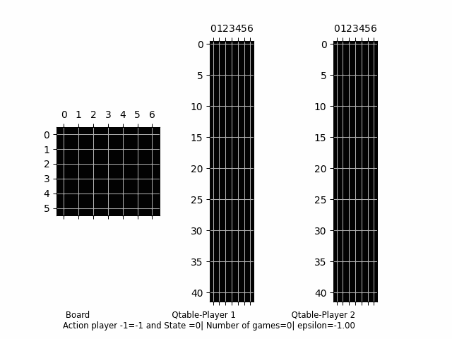

# Connect_X_with_Deep_Q_learning
xplores the use of reinforcement learning algorithms, specifically deep Q- learning, to build an AI agent for the Connect Four board game.

### Intro

Due to developments in AI and machine learning, playing board games against AI opponents has grown in popularity in recent years. A more realistic and interesting experience can be had by using AI-powered game engines, which can present players with powerful opponents that can adjust to various play styles. AI agents may also go through a massive amount of game data to find patterns and methods that humans might not have noticed. Both humans and AI agents may benefit from better gaming as a result of this. Nowadays it’s possible to explore strategy and tactics in a competitive setting thanks to the emergence of AI-powered board game opponents, and it will be interesting to see how this trend develops in the future.

One of the most popular two-player strategy games for decades is Connect Four [1]. The goal of the game, which is played on a 6x7 board, is to line up four of your own colored discs in a row in any direction before your opponent does the same. The game is a favorite of both competitive and casual players since it is easy to learn but offers a great lot of depth in terms of strategy.

A Connect Four learning AI bot can be developed using reinforcement learning (RL). A combination of supervised and unsupervised learning can be used to train the agent to predict game states depending on the state of the board and the player’s move. The agent can also gain knowledge by self-play, in which it competes with a replica of itself to develop a better strategy over time. To increase its chances of winning the game, the agent can use RL to improve its decision-making process and learn from experience.

An AI agent can be taught to play Connect Four using reinforcement learning (RL), however, due to the numerous different game states, the agent must learn to generalize from observed states. Deep Q-learning, which uses neural networks to estimate the value of each potential action in a given state, can be used to accomplish this. Another crucial factor to take into account when training the agent is balancing exploration and exploitation, which can be done by employing an epsilon-greedy exploration approach. By contrasting human choices with those of a skilled AI agent, RL can be used to assess and enhance human games and reveal top-level strategies and heuristics.

A Kaggle competition was recently organized to find the greatest Connect Four AI bot. The Connect Four competition on the Kaggle platform asked competitors to develop an AI bot that could outperform the greatest human players. Participants in the tournament came from all around the world, and the winning submission employed a combination of Monte Carlo tree search and deep reinforcement learning to achieve an impressive level of play. The contest demonstrated the potential of reinforcement learning to transform the way we play strategic games and the strength of AI.

