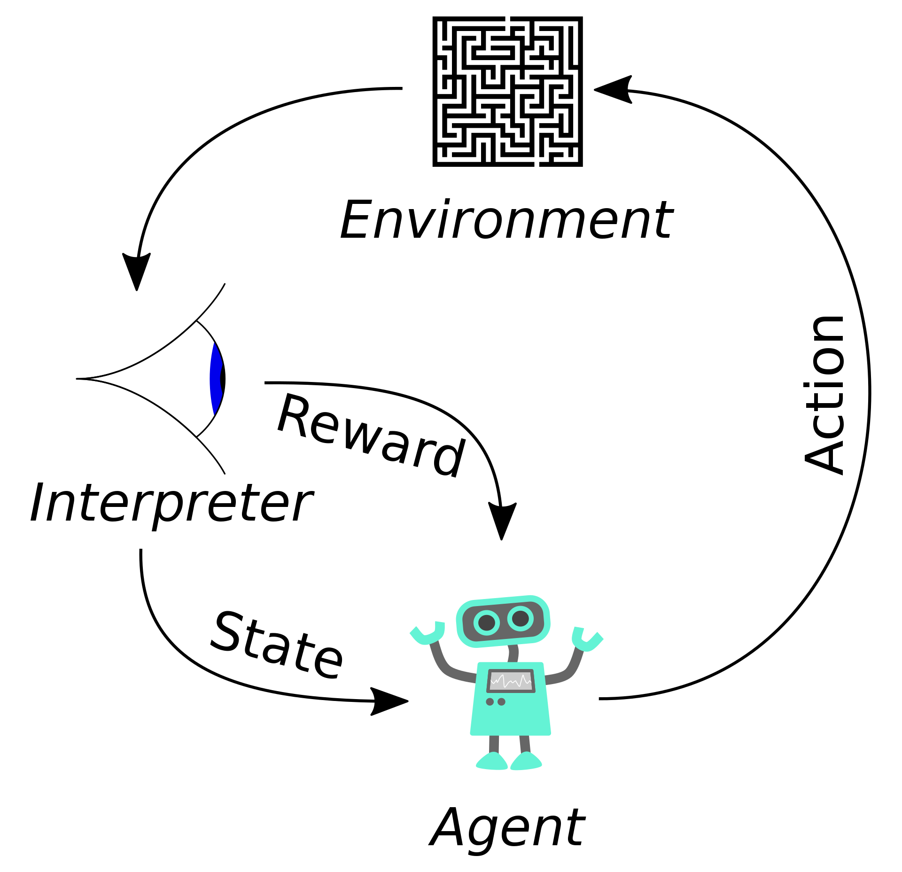
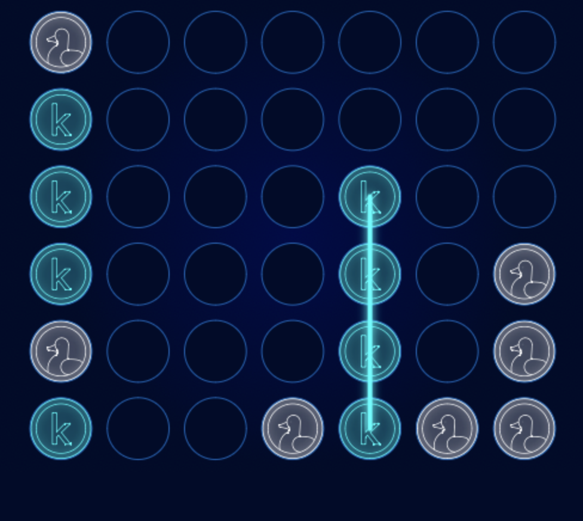

# Connect_X_with_Deep_Q_learning
xplores the use of reinforcement learning algorithms, specifically deep Q- learning, to build an AI agent for the Connect Four board game.

### Intro

Due to developments in AI and machine learning, playing board games against AI opponents has grown in popularity in recent years. A more realistic and interesting experience can be had by using AI-powered game engines, which can present players with powerful opponents that can adjust to various play styles. AI agents may also go through a massive amount of game data to find patterns and methods that humans might not have noticed. Both humans and AI agents may benefit from better gaming as a result of this. Nowadays it’s possible to explore strategy and tactics in a competitive setting thanks to the emergence of AI-powered board game opponents, and it will be interesting to see how this trend develops in the future.

One of the most popular two-player strategy games for decades is Connect Four [1]. The goal of the game, which is played on a 6x7 board, is to line up four of your own colored discs in a row in any direction before your opponent does the same. The game is a favorite of both competitive and casual players since it is easy to learn but offers a great lot of depth in terms of strategy.

A Connect Four learning AI bot can be developed using reinforcement learning (RL). A combination of supervised and unsupervised learning can be used to train the agent to predict game states depending on the state of the board and the player’s move. The agent can also gain knowledge by self-play, in which it competes with a replica of itself to develop a better strategy over time. To increase its chances of winning the game, the agent can use RL to improve its decision-making process and learn from experience.

An AI agent can be taught to play Connect Four using reinforcement learning (RL), however, due to the numerous different game states, the agent must learn to generalize from observed states. Deep Q-learning, which uses neural networks to estimate the value of each potential action in a given state, can be used to accomplish this. Another crucial factor to take into account when training the agent is balancing exploration and exploitation, which can be done by employing an epsilon-greedy exploration approach. By contrasting human choices with those of a skilled AI agent, RL can be used to assess and enhance human games and reveal top-level strategies and heuristics.

A Kaggle competition was recently organized to find the greatest Connect Four AI bot. The Connect Four competition on the Kaggle platform asked competitors to develop an AI bot that could outperform the greatest human players. Participants in the tournament came from all around the world, and the winning submission employed a combination of Monte Carlo tree search and deep reinforcement learning to achieve an impressive level of play. The contest demonstrated the potential of reinforcement learning to transform the way we play strategic games and the strength of AI.

### Background
#### Reinforcement Learning
Reinforcement learning (RL) is a type of machine learning that teaches an agent how to operate in a given environment in a way that will maximize a reward signal. The agent picks up new skills by trial and error, experimenting with various behaviors and analyzing the results, then modifying its behavior over time to maximize the reward 

As you can see in figure2 an agent takes actions in an environment, which is interpreted into a reward and a representation of the state, which are fed back into the agent. The environment is typically formulated as a Markov decision process (MDP)

#### Markov decision process
A mathematical framework called a Markov decision process (MDP) is used in reinforcement learning to describe decision-making issues. A set of potential states, a set of potential actions, and the rewards connected to executing those actions in each state are all described by MDPs. The main principle of an MDP is that state transition probabilities and rewards are entirely set by the state and action that is being taken at any one time, rather than by the history of prior states and acts. This is known as the Markov property.

A Markov decision process is a 4-tuple  $(S,A,P,R)$ , where as shown the figure 3, $S$ is a set of agent states, A is a set of actions the agent can take. $P = \text{Pr}(s_{t+1} = s' \mid s_t = s, a_t = a)$ is the probability of transition from state  $s$  to state  $s'$  under action $a \cdot P: A \times S \rightarrow \mathbb{R}^S$. Also, $R(s, s', a)$ is the immediate reward after transition from  $s$  to  $s'$  with action $a \cdot R: S \times S \times A \rightarrow \mathbb{R}$

In this article, we discuss two approaches to create a reinforcement learning agent to play and win the game.

#### Deep Q-Learning

Given that it has no restrictions on the observations it may make or the actions it can take in complicated situations, Deep Q-Learning might be one of the most significant algorithms in all of Reinforcement Learning. With the aid of a system of observations, actions, and rewards, an agent can repeatedly "play" an environment using this reinforcement learning technique, which also integrates deep neural networks.

deep Q-learning includes teaching a deep neural network to approximative the best Q-value function for a certain job. The predicted cumulative reward that an agent can earn by taking a specific action in a specific state and then implementing the best course of action is represented by the Q-value function. In deep Q-learning, the neural network receives the environment's current state as input and produces an estimated Q-value for each potential action. After selecting the action with the highest Q-value, which is commonly done by employing an epsilon-greedy exploration approach, the agent takes that action.

A variation of the Q-learning algorithm is used to train the neural network, and it entails reducing the mean squared error between the anticipated Q-value and the actual Q-value determined by the Bellman equation. During training, the Q-value estimations are updated using the Bellman equation, which depicts the recursive relationship between the current Q-value and the anticipated future Q-value. The replay buffer, which saves a portion of the agent's experience and randomly samples from it to decorrelate the training data and stabilize learning, is often used to train neural networks.

There is an inevitable trade-off between exploration and exploitation in all Reinforcement Learning issues. Epsilon decay is a phenomenon that is often used to address this issue.
The probability that an agent will select a random action as opposed to one that has been predetermined by the network is represented by the epsilon in the epsilon decay equation. The epsilon decay is exactly that: since we expect the agent to be, for lack of a better word, stupid early in the training cycle, we will let it make essentially random decisions, allowing it to explore rather than exploit since it hasn't yet learned anything to exploit. The epsilon will shrink with time, meaning that the agent will begin to rely more and more on its acquired knowledge and less and less on random behaviors.

### Results

We will develop our agent using (with a few modifications) the Connect X framework from a current Kaggle competition. Without having to create the Connect 4 game from scratch, this will make it very easy for us to get observations from the environment and deliver commands to the environment. 
The only minor modification to the Kaggle-provided environment was the manual determination of the game's end time. This made it possible to determine rewards for various victories, losses, and incorrect movements.

First, the model is just a dense neural network constructed using the keras module. Due to the small size of the board, our initial attempt at using a convolutional neural network did not turn out as well as we had hoped. Seven neurons make up the network's output, each of which represents the action of dropping a chip into one of the board's seven separate columns.

Each observation/activity pair is assigned a loss value that is inversely proportional to the reward obtained by the loss function, which essentially takes the total rewards for an episode and applies them to each input and output of the network (observation and action, respectively).
For instance, if the agent wins a game, the greatest reward available under our reward structure of 20 will be awarded to all observation/action pairings throughout the game. The inverse relationship is caused by the modest loss value that will follow. Since the objective of any standard optimizer is to reduce the network's loss, this inverse relationship enables our optimizer to direct network optimization toward positive rewards. Theoretically (and considerably less frequently in practice), decreasing loss will then boost reward, increasing the network's capacity to make Connect 4 game-winning judgments.

For trade-off between exploration and exploitation. This agent will employ the epsilon decay function, where $x$ is the quantity of episodes learnt and $\epsilon =.99985x$. 

Now that the entire structural system has been constructed We begin by creating the memory object that will be used to transmit data from the environment to the network. Following that, we repeat the process for each episode—in this case, 1,000—properly communicating observations and rewards to the network in accordance with the requirements of the aforementioned functions.

The following is a game played by our agent (blue) against the random agent (grey). 

As a results, we have got $85.00\%$ winning when the trained agent has played against a random player. Which is much better than the winning percentage that we got using Q-learning.

#### Play against the agent
Although the agent's actions are undoubtedly impressive, But it could not compete with human-level intelligence. However, you can use the "play with agent" section in the code to play with our trained agent and test it. 

